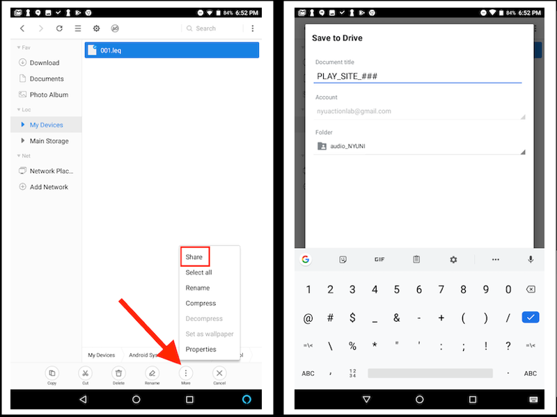

# Post-visit

## Post Visit notes, Clean up, and Upload 

After each visit, when you arrive back at your lab, complete all the following steps on the day you collected the data or on the very next day.

1. Submit home questionnaires.
    - Open the completed questionnaire on the tablet and hit the submit button. Tablet must be connected to wifi.   
2. Complete and submit PLAY Post-Visit Notes   
    - https://ee.kobotoolbox.org/x/#2cAYQt3z   
3. Upload all videos from the visit to Databrary onto your university's PLAY volume.  
Use the naming convention for each of the four videos. Use your 5 letter code for SITE. Use 3 digits for subject number (###).
    - Name the session as: <b>PLAY_SITE_###</b>  
    - Name the Natural Play video as: <b>PLAY_SITE_###_NaturalPlay</b>  
    - Name the House Walkthrough video as: <b>PLAY_SITE_###_HouseWalkthrough</b>  
    - Name the Structured Play video as: <b>PLAY_SITE_###_StructuredPlay</b>  
    - Name the Questionnaires video as: <b>PLAY_SITE_###_Questionnaires</b>  
4. Select appropriate release level for session in Databrary.
    - https://www.databrary.org/resources/guide/investigators/release/release-levels.html
5. Make sure that all fields on Databrary are filled out.  
If visit is excluded mark as:
    - Pilot
    - Atypical
    - Out of age range
    - Cancelled (if visit was cancelled)
    - Experimental error (equipment malfunction)
    - Incomplete
6. Submit decibel data.
    - Please access the decibel app file on your tablet (located in the "AudioTool" folder in the File Manager). Select the decibel file from this home visit session. 
    - Select "Share with Save to Drive", navigate to the audio file folder for your site (e.g., ‘audio_NYUNI’) and drop your file in that location.
    - Name the file as follows: <b>PLAY_SITE_###</b>
    - 
7. Fill out form to submit session for quality assurance. https://forms.gle/dyqtsAxx3D8LJuTr8.
8. Clean equipment.
    - Wash all toys and equipment thoroughly.
    - Wipe down yoga mat.
    - Once videos have been uploaded, delete all videos from SD card.
    - Make sure to put away all equipment to have ready for a next visit.

----

At the end of every home visit (for each participant), you will upload the following:

1. **exactly 4 videos** (to your Databrary repository)
 &nbsp; - One-hour naturalistic play (include: decibel measure, shoes if child is wearing them in the house)
 &nbsp; - House walk-through (include: measurements of each room, sleeping arrangements, clothing, books, toys, shoes if child is barefoot)
 &nbsp; - 5-min structured play (focus on child and mom, even if they leave mat area)
 &nbsp; - Questionnaires (set up camera on tripod, focus on mom)
2. **exactly 1 decibel meter file** (to your Databrary repository)
3. **exactly 3 questionnaire files** (through the KoBo Toolbox app)
 &nbsp; - demographics questionnaire
 &nbsp; - home visit questionnaire
 &nbsp; - post-visit notes
 

