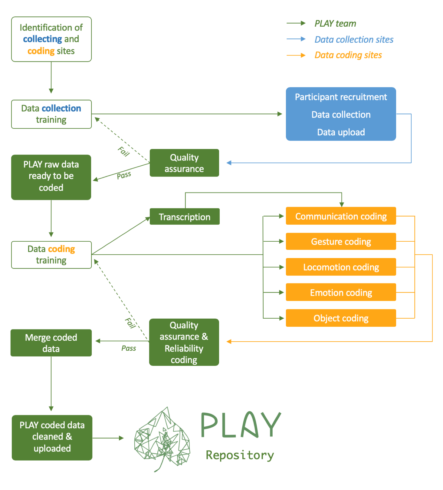

# (PART\*) Data Management & Quality Assurance {-}

# Data management

## Coding workflow

The following figure summarizes the data management and quality assurance steps involved in the PLAY project.

```{r, echo=FALSE, out.width="70%", fig.cap="PLAY workflow"}

```

## KoBoToolbox workflow

The KoBoToolbox workflow is not (yet) represented in the figure, but it may be thought of as a part of the green 'Merge coded data' box.

Survey data collected via the KoBoToolbox tablet application can be accessed by PLAY staff via the KoBoToolbox API.

Workflows describing the download, cleaning, and aggregation of survey data can be found in a separate repository: <https://github.com/PLAY-behaviorome/KoBoToolbox/>. 

The general philosophy is to separate steps and save more intermediate files than seems optimal. This is to reduce the possibility of data loss.

### Challenges to surmount

There are huge advantages to using a tool like KoBoToolbox, but some design constraints with PLAY have made the export process somewhat complicated. We chose to combine a set of separate survey questions into one omnibus KoBoToolbox survey or 'form'. However, there are different questions and instructions depending on whether the mother is an English speaker, bilingual but dominant in English, or bilingual but dominant in Spanish. This means we need separate survey forms for each case. In addition, the questions asked about 12-month-olds in the MB-CDI differ from those asked about 18- and 24-month-olds. This adds another dimension so that we now need 9 separate KoBoToolbox forms. Finally, the survey questions have evolved over time, so that we have two versions that have been deployed in the field, with a third in-process. At the present time, this means that there are 2 version x 3 age groups x 3 language groups or 18 separate forms to download and process from KoBoToolbox.

The form/file names are reasonably orderly, so that we can search for strings like 'English' and '2021' in processing them.

### Summary of processing steps

Here are the main steps:

1. Download XLSX-formatted files from KoBoToolbox.org via the API. Save the downloaded files in a local directory that is **not** synched to GitHub. See <https://play-behaviorome.github.io/kobotoolbox/01-download-from-KoBo.html> for more details.

2. Import the XLSX files and export them as CSVs to a separate local directory that is **not** synched to GitHub. See <https://play-behaviorome.github.io/kobotoolbox/02-save_raw_csvs.html> for more details. 

3. Import the raw CSV files and split them into separate files, one for the MB-CDI questions and a second for all other non-MBCDI questions. <https://play-behaviorome.github.io/kobotoolbox/03-split_MBCDI_others.html> for more details.  

4. Remove identifying information like names, exact dates, and contact information before exporting these files. See <https://play-behaviorome.github.io/kobotoolbox/04-remove_identifiers.html>.

5. Carry out preliminary 'light' quality assurance (QA) on the data files. See <https://play-behaviorome.github.io/kobotoolbox/05-conduct_initial_qa.html>.

6. Create aggregate files that combine non-MB-CDI data across the forms, age groups, and language groups. We will consult with the PLAY language expert group about how to do additional post-processing and cleaning of the MB-CDI data. This step also (optionally) merges the data from KoBoToolbox with that stored about the associated Databrary sessions. See <https://play-behaviorome.github.io/kobotoolbox/06-make_aggregate_csv.html>.

Once these steps are completed, it is possible to render a document that provides simple visualizations of the survey data, as in <https://play-behaviorome.github.io/kobotoolbox/release_1.0_survey_report.html>. As of 2022-03-18, this report contains information that links sessions to specific data collection sites, so the team is not sharing this publicly.

### Data sharing

Our plan is to copy the aggregate CSV to a materials folder on the shared Databrary volume.

In the future, we will export session-level data files to the session folders for each participant.

